# Command Launcher

      

A launcher extension that manages commands for the command palette and terminal command.

## Usage
### Step1.
Press '`⇧⌘P`' to bring up the command pallete and enter '`Command Launcher - Edit`'.

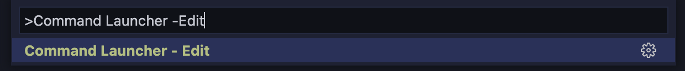

### Step2.
Customize the menu as you like.

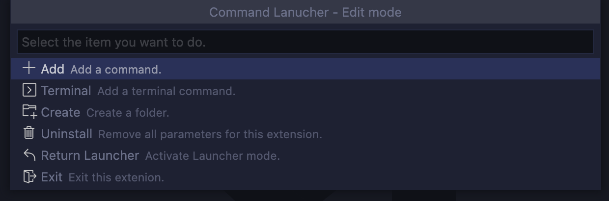

### Step3.
Press '`⇧⌘P`' to bring up the command pallete and enter '`Command Launcher`'.

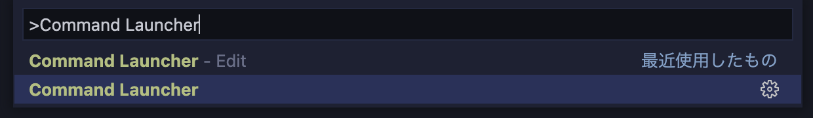

Your own toolbox is ready!

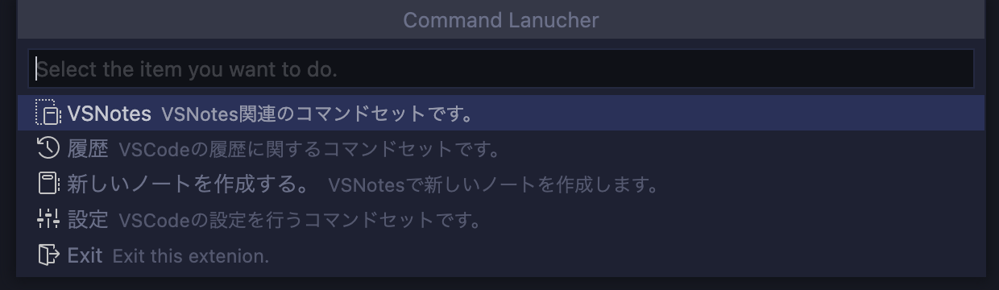

## Feature
### Easy Setup
Just follow the guide to easily set the menu.

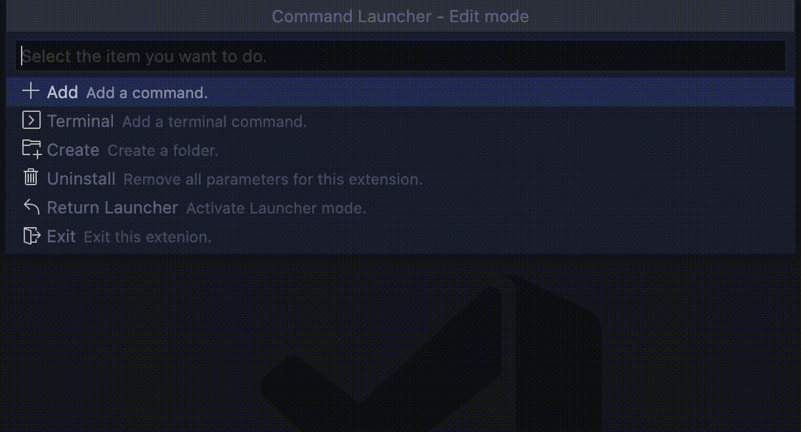

### Command - Calling other extension
Check the "`Feature Contributions`" -> "`Commands`" -> "`Name`" of the extension you wish to call.

Set its value as a command.

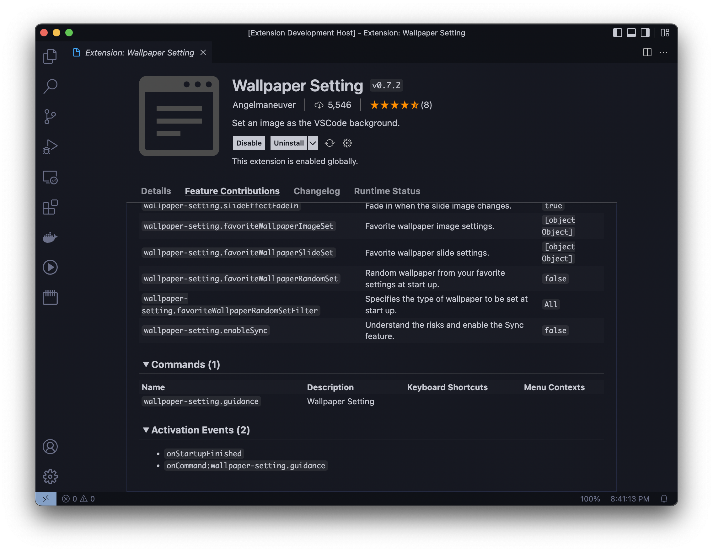

### Command - Calling VSCode's command
First, "`Command Pallete`" -> "`Gear`" in that order.

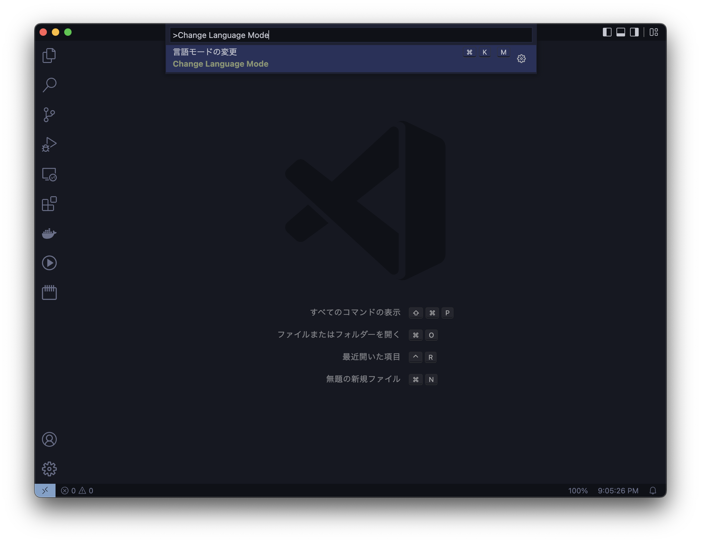

The value entered in the filter is the value of the command you wish to call.

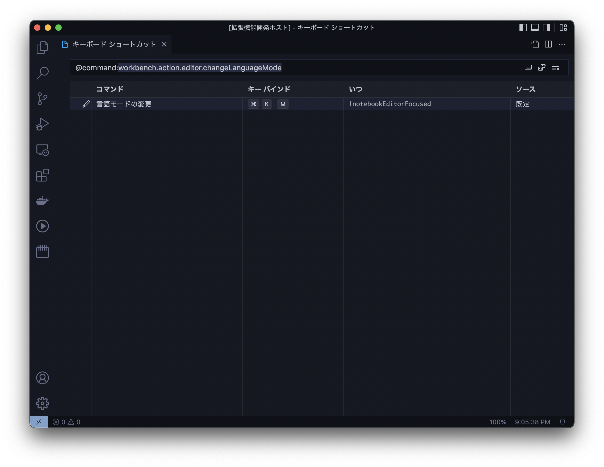

### Command - Execute Terminal's command
You can execute terminal commands from the menu.

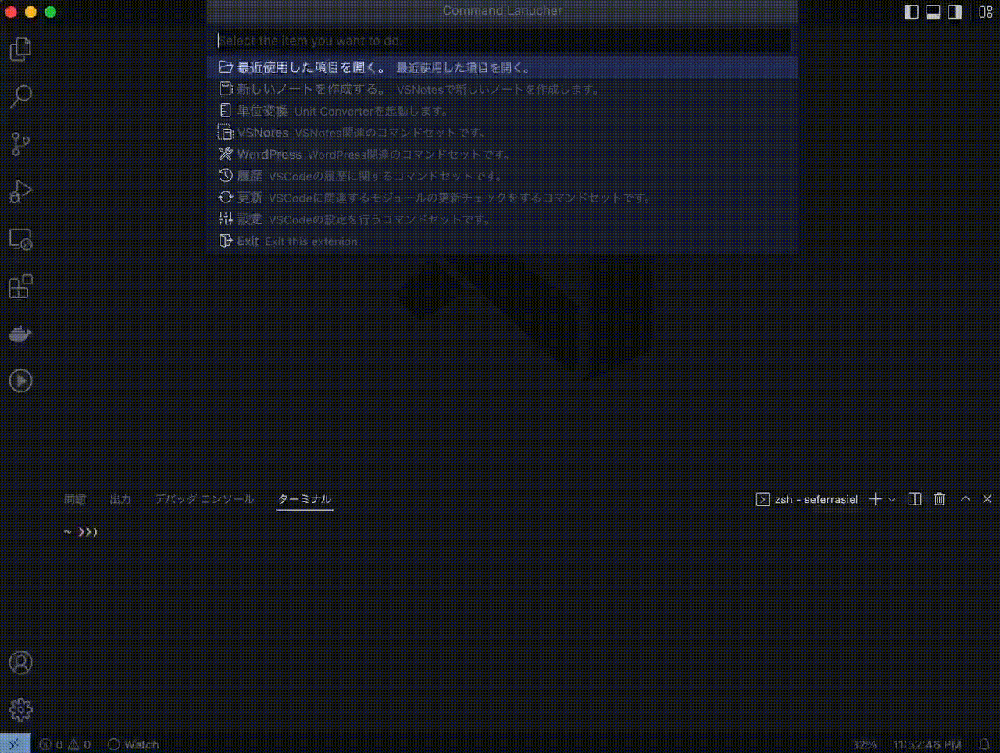

#### Singleton
Are there any terminal commands that keep working? (e.g, a command that detects file change and recompiles them etc...)

The singleton feature allows you to have only one process execute that commands.

No more need to switch terminals!

#### History
Having trouble entering the same terminal commands?

The history function eliminates that difficulty.

##### Usage
Press '⇧⌘P' to bring up the command pallete and enter 'Command Launcher - History'.

\* The history function is disabled by default.

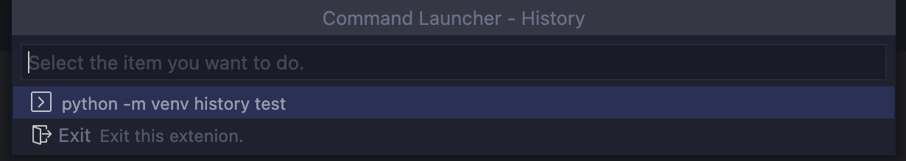

### Folder
You can create folders to manage commands.

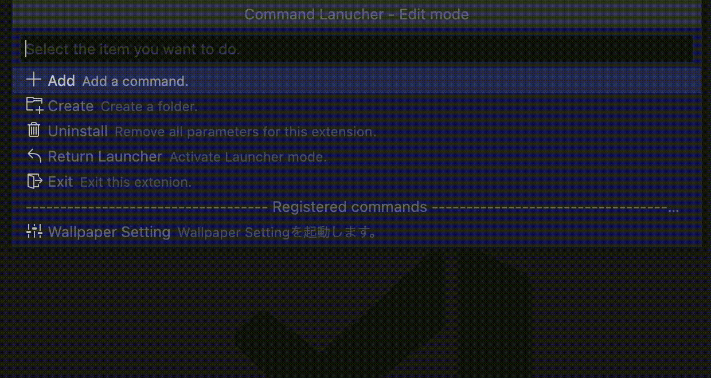

### Uninstall
Didn't like this extension?

Sorry for not being able to help you.

Let's uninstall it and erase all settings related to this extension.

It won't pollute your environment.

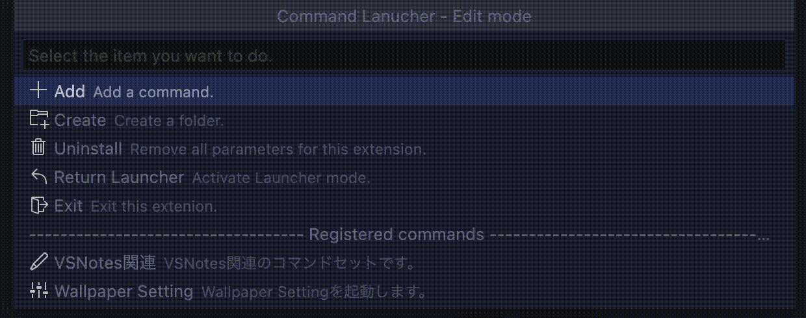

## Cautions
### How will this extension affect your environment?
This extension will make changes to the following file.

1. settings.json

## Support

