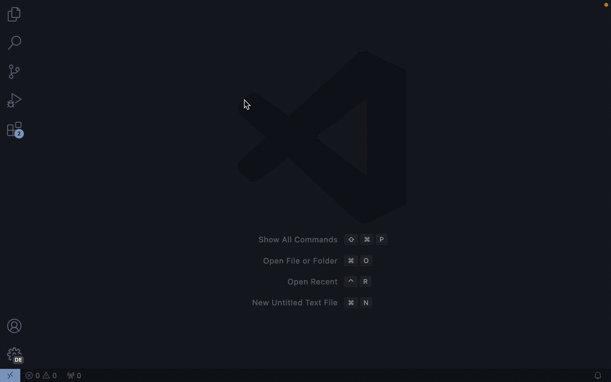
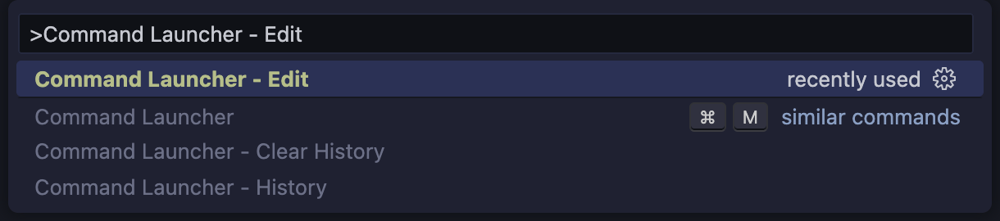
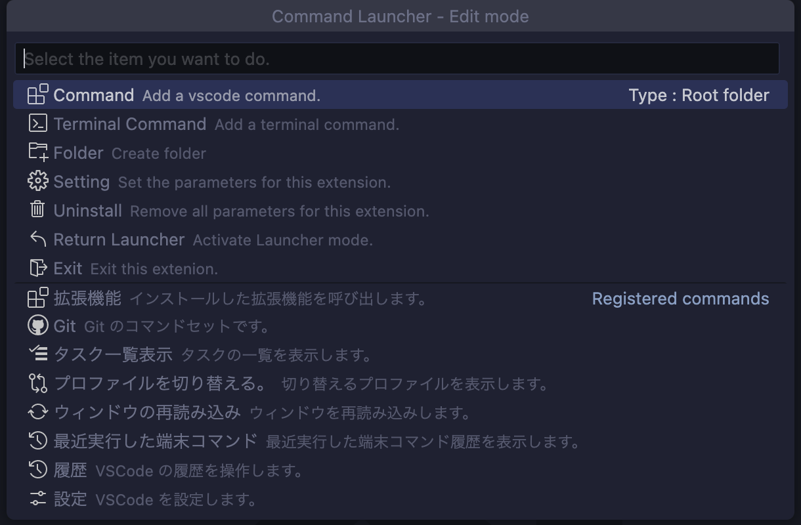
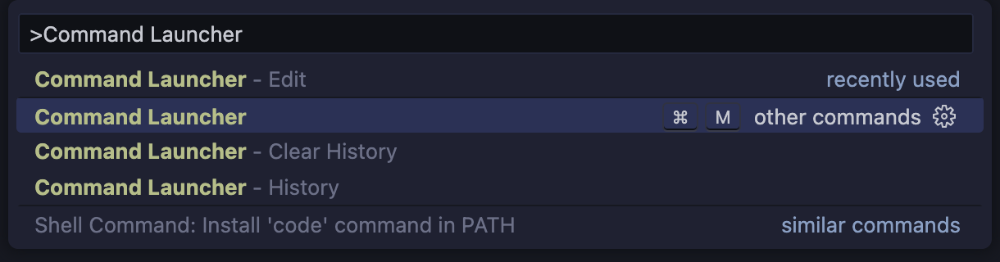
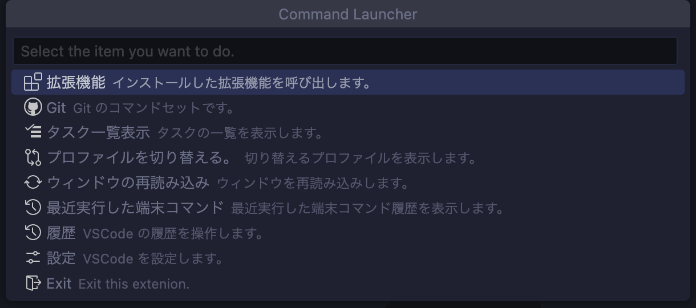
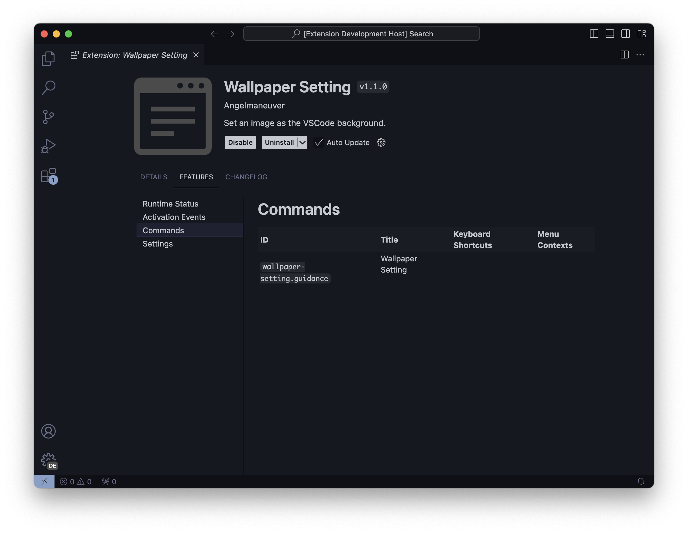
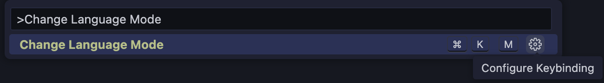
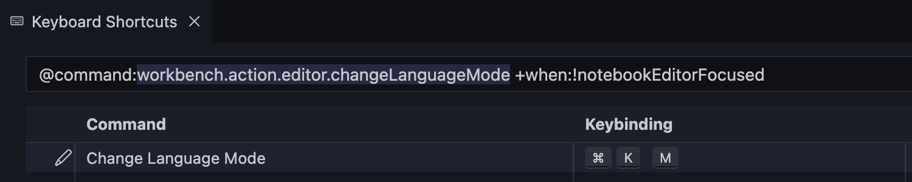

	<h1>Command Launcher</h1>
	
Toolbox to manage your extensions and terminal commands.

	

    
    
		
		
		
		
	

## Usage

### Step1. Customize menu

Press `⇧⌘P` to bring up the command pallete and enter '`Command Launcher - Edit`'.

and Customize the menu as you like.

### Step2. Run commands

Press `⇧⌘P` to bring up the command pallete and enter '`Command Launcher`'.

Your toolbox is ready!

## Feature

### Command - Calling other extension

You can call the extensions you have installed.

Click here to see more detail on how to set up.

#### How to check the value

Check the Extension's page `FEATURES` -> `Commands` -> `ID` of the extension you wish to call.

Set its value as a command.

\* In the image example, `wallpaper-setting.guidance`.

### Command - Calling VSCode's command

You can call the VSCode's commands.

Click here to see more detail on how to set up.

#### How to check the value

First, `Command Pallete` -> `You want to set the VSCode's command` -> `Gear (Configure Keybinding)`.

The value entered in the filter is the value of the command you wish to call.

\* In the image example, `workbench.action.editor.changeLanguageMode`.

### Terminal Command - Execute Terminal's command

You can execute terminal commands from the menu.

#### Question

Ability to assemble terminal command by typing or selecting from a pre-created set of choices.

#### Confirm

Ability to run terminal command without automatically run them, but only after confirm to see if they should be run.

#### Singleton

Are there any terminal commands that keep working? (e.g, a command that detects file change and recompiles them etc...)

The singleton feature allows you to have only one process execute that commands.

No more need to switch terminals!

#### Tree View

You can executed commands from the Activitybar.

#### History

Having trouble entering the same terminal commands?

The history function eliminates that difficulty.

### Uninstall

Didn't like this extension?

Sorry for not being able to help you.

Let's uninstall it and erase all settings related to this extension.

It won't pollute your environment.

## Cautions

### How will this extension affect your environment?

This extension will make changes to the following file.

1. settings.json

## External libraries used by this extension

1. [lodash](https://github.com/lodash/lodash)
